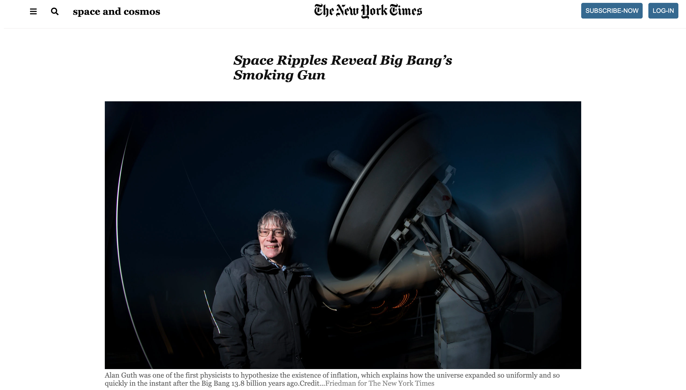

# Floats and Positioning

> This project is a clone of a page in New York Times' website, which is a part of the Microverse HTML and CSS curriculum.

This project was carried out with utmost carefulness to make the clone resemble the New York Time's page as much as possible.

## Built With

- HTML
- CSS
- Font Awesome
- Google fonts API

## Live Demo

[Live Demo Link](https://livedemo.com)

## Getting Started

Clone this repo and open the index.html file in any browser or web viewer of your choice.

## Authors

👤 **CY Kalu**

- GitHub: [@cyonii](https://github.com/cyonii)
- Twitter: [@twitterhandle](https://twitter.com/theOnuoha)
- LinkedIn: [LinkedIn](https://www.linkedin.com/in/silas-kalu-2a9a13199/)

👤 **Juwon Oluwadare**

- GitHub: [@wintan1418](https://github.com/wintan1418)

## 🤝 Contributing

Contributions, issues, and feature requests are welcome!

Feel free to check the [issues page](issues/).

## Show your support

Give a ⭐️ if you like this project!

## Acknowledgments

- Microverse
- New York Times
